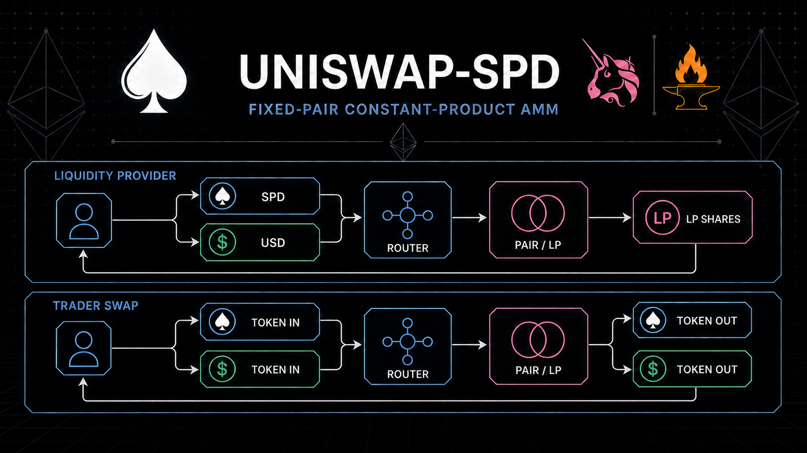
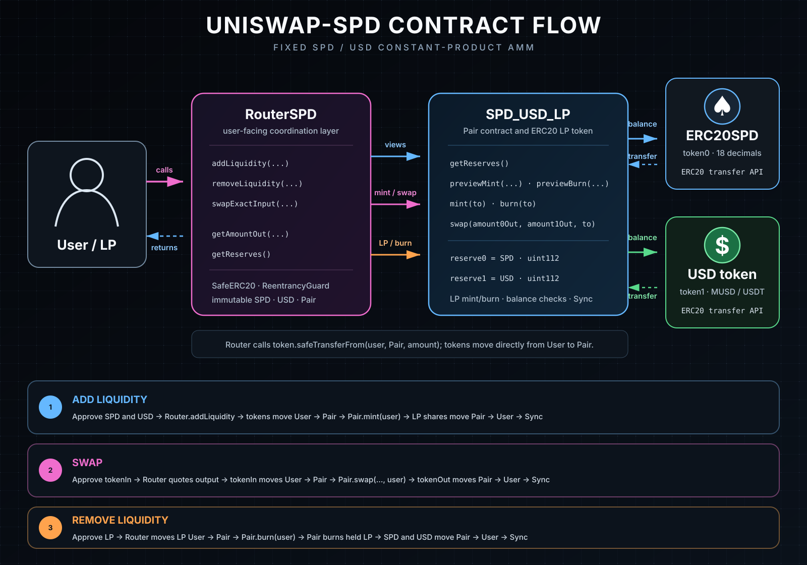

# uniswap-SPD

`uniswap-SPD` is a fixed SPD/USD constant-product AMM built with Foundry and OpenZeppelin Contracts. It provides liquidity deposits, proportional LP shares, withdrawals, exact-input swaps, a 0.3% swap fee, and user-defined slippage protection.

The project uses one fixed Pair and one Router. It is unaudited and should not hold assets of value.

## Architecture



- `token0` is always SPD; `token1` is always the configured USD token.
- `SPD_USD_LP` is both the Pair and its ERC-20 LP token.
- `RouterSPD` coordinates transfers, Pair calls, quotes, and slippage checks.
- Tokens move directly between users and the Pair; the Router does not custody them.
- The Pair remains directly callable and has no `onlyRouter` restriction.

## Contracts

| Contract | Purpose |
| --- | --- |
| [`ERC20SPD`](https://github.com/arshamhaq/ERC20-SPD/blob/main/src/ERC20SPD.sol) | SPD dependency and `token0`. Deployed locally or referenced at its existing Sepolia address. |
| [`MockUSD`](src/tokens/MockUSD.sol) | Unrestricted local test token named `MockUSD` (`MUSD`). |
| [`SPD_USD_LP`](src/SPD_USD_LP.sol) | Holds both assets, records reserves, executes AMM accounting, and issues LP shares. |
| [`RouterSPD`](src/RouterSPD.sol) | User-facing entry point for liquidity operations and exact-input swaps. |

Interfaces are defined in [`ISPD_USD_LP`](src/interfaces/ISPD_USD_LP.sol) and [`IRouterSPD`](src/interfaces/IRouterSPD.sol).

## Protocol flow

### Add liquidity

1. The user approves the Router for SPD and USD.
2. The Router calculates the reserve-matched USD deposit and checks `minUsdAmount` and `minShares`.
3. SPD and USD move directly from the user to the Pair.
4. The Router calls `pair.mint(user)` and LP shares are minted to the user.

Initial shares use `sqrt(spdAmount × usdAmount)`. Later shares are proportional to the existing reserves and LP supply.

### Swap

1. The user approves the Router for `tokenIn`.
2. The Router quotes the output and checks `minAmountOut`.
3. `tokenIn` moves directly from the user to the Pair.
4. The Pair sends `tokenOut` directly to the user, validates the fee-adjusted output, and updates reserves.

The quote applies the conventional `997 / 1000` input adjustment, leaving the 0.3% fee in the pool.

### Remove liquidity

1. The user approves the Router for LP shares.
2. The Router checks the preview against `minSpdOut` and `minUsdOut`.
3. LP shares move from the user to the Pair.
4. The Pair burns its own LP balance and sends proportional SPD and USD directly to the user.

## Important assumptions

- Reserves are stored as `uint112` and synchronized to actual Pair balances after successful Pair operations.
- Local SPD and MockUSD use 18 decimals; Sepolia test USDT uses 6. Amounts are always passed in each token's smallest unit.
- Direct token transfers to the Pair create unclaimed balances. Follow transfers atomically with `mint` or `swap` through the Router.
- Direct LP transfers to the Pair create burnable LP balances. Use the Router to transfer and burn atomically.
- The implementation expects conventional ERC-20 behavior; rebasing and fee-on-transfer tokens are unsupported.
- `SafeERC20`, `ReentrancyGuard`, custom errors, reserve bounds, and post-operation minimum checks protect the supported flows.

There is no Factory, token sorting, owner/admin control, deadline, WETH integration, multihop routing, flash swap, oracle, protocol fee, or `MINIMUM_LIQUIDITY` lock.

## Project layout

```text
src/
├── SPD_USD_LP.sol
├── RouterSPD.sol
├── interfaces/
│   ├── ISPD_USD_LP.sol
│   └── IRouterSPD.sol
└── tokens/
    └── MockUSD.sol

script/DeployUniswapSPD.s.sol
test/{unit,fuzz,invariant}/
```

## Installation

Requirements: [Foundry](https://book.getfoundry.sh/getting-started/installation), Git, and Make.

```bash
git clone --recurse-submodules https://github.com/arshamhaq/uniswap-SPD.git
cd uniswap-SPD
cp .env.example .env
forge build
forge test
```

If the repository was cloned without submodules:

```bash
git submodule update --init --recursive
```

Configured remappings:

```text
@openzeppelin/contracts/ → lib/openzeppelin-contracts/contracts/
@spd/                    → lib/ERC20-SPD/src/
```

## Testing

```bash
make test
make test-fuzz FUZZ_RUNS=5
make test-invariant INVARIANT_RUNS=32 INVARIANT_DEPTH=32
```

The suite includes a full liquidity/swap/withdrawal scenario, focused unit tests, parameterized fuzz tests, a reentrancy attempt, and stateful invariants for reserve synchronization and swap product behavior.

Additional Foundry options can be passed through `ARGS`:

```bash
make test ARGS="-vvvv --match-test testSpdToUsdSwapWorks"
make test-fuzz FUZZ_RUNS=1000 ARGS="-vv"
```

## Environment

`.env` is ignored by Git. Copy `.env.example` and configure the required network values.

| Variable | Purpose |
| --- | --- |
| `TEST_MODE` | `1` deploys all contracts locally; `0` uses existing Sepolia tokens. |
| `RPC_URL_ANVIL` | Local Anvil endpoint. |
| `PRIVATE_KEY_ANVIL` | Disposable Anvil development key. Never use it publicly. |
| `INITIAL_SUPPLY` | Initial local SPD supply in raw 18-decimal units. |
| `MAXIMUM_SUPPLY` | Local SPD cap in raw 18-decimal units. |
| `MOCK_USD_INITIAL_SUPPLY` | MockUSD minted to the local deployer. |
| `RPC_URL` | Ethereum Sepolia RPC endpoint. |
| `PRIVATE_KEY` | Funded Sepolia deployer key. Keep it secret. |
| `SPD_SEPOLIA_ADDRESS` | Existing Sepolia SPD deployment. |
| `USDT_SEPOLIA_ADDRESS` | Existing 6-decimal Sepolia test USDT. |

## Deployment

### Anvil

Start Anvil in one terminal and deploy from another:

```bash
make anvil
make deploy-anvil
```

Local mode deploys `ERC20SPD`, `MockUSD`, `SPD_USD_LP`, and `RouterSPD`. It assigns the SPD roles to the broadcaster and mints the configured token supplies to that account.

### Sepolia

Default token addresses:

- SPD: [`0x805540aC3b8AE7dE3c991Df03999AD6fa36ca914`](https://sepolia.etherscan.io/address/0x805540aC3b8AE7dE3c991Df03999AD6fa36ca914)
- Aave test USDT: [`0xaA8E23Fb1079EA71e0a56F48a2aA51851D8433D0`](https://sepolia.etherscan.io/address/0xaA8E23Fb1079EA71e0a56F48a2aA51851D8433D0)

The USDT address is Aave's 6-decimal Sepolia test asset, not a Tether-issued deployment.

Set `RPC_URL` and `PRIVATE_KEY` in `.env`, fund the deployer with Sepolia ETH, then run:

```bash
make deploy-sepolia
```

Sepolia mode validates chain ID `11155111` and the token bytecode, then deploys only the Pair and Router. It does not add liquidity.

## Make targets

| Command | Purpose |
| --- | --- |
| `make build` | Compile the project. |
| `make test` | Run all tests. |
| `make test-fuzz` | Run fuzz tests with configurable `FUZZ_RUNS`. |
| `make test-invariant` | Run invariants with configurable run and depth values. |
| `make anvil` | Start a local node; pass options with `ARGS`. |
| `make deploy` | Deploy according to `TEST_MODE`. |
| `make deploy-anvil` | Deploy the complete local stack. |
| `make deploy-sepolia` | Deploy Pair and Router on Sepolia. |

Use `ARGS` for optional Forge flags, for example:

```bash
make deploy-sepolia ARGS="--verify"
```

## Security notice

This repository has not been audited or formally verified. Review the contracts, tests, token assumptions, and omitted protocol features before any deployment beyond disposable test environments.
